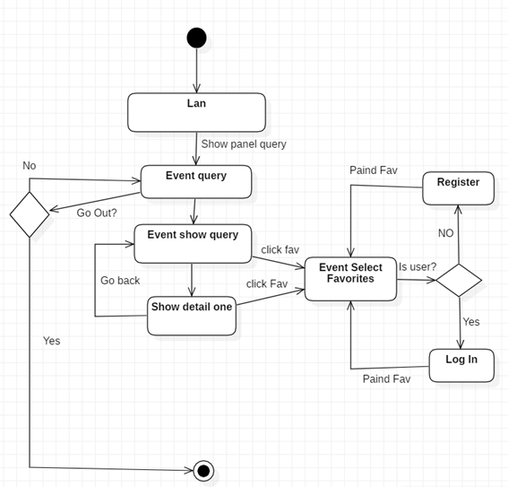
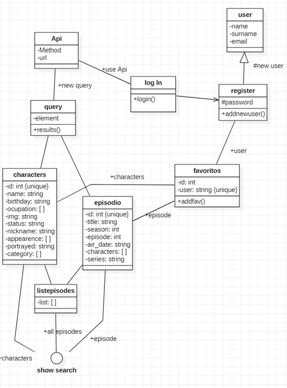
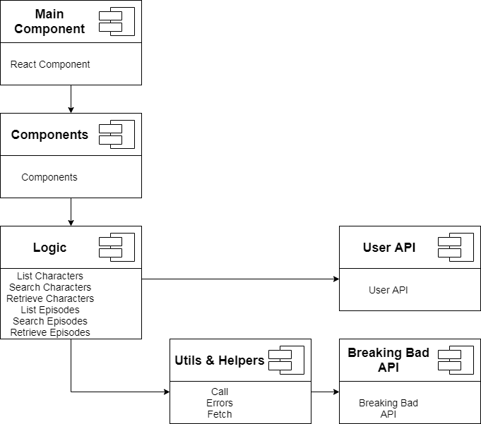
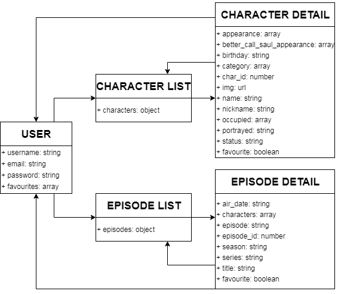

# Breaking App

## Intro

Breaking App is an application designed for the lovers of the Breaking Bad TV series. In this app, the users can watch the list of characters and episodes, alongside other information like birthdates of the characters, their ocupation, name of the actor that plays the role, etc. Users can also register and select their favourite episodes and characters.

*Breaking App es una aplicación diseñada para los amantes de la serie de TV Breaking Bad. En ella, los usuarios podrán consultar la lista de personajes y episodios de la serie, junto con otras informaciones como la fecha de nacimiento del personaje, su ocupación, nombre del actor que lo interpreta, etc. Los usuarios también podrán registrarse y seleccionar sus episodios y personajes favoritos.*

### Authors

+ Isidro
+ Joan
+ Rubén

## Functional Description

### Use Cases

### Activity Diagram

### Class Diagram

## Technical Description

### Blocks

### Components

### Data Model

### Code Coverage

Jasmine Screenshot

### Built with

+ JavaScript with React
+ HTML
+ CSS with Sass
+ Tests made with Jasmine

## Errors and Bugs Founded

The 'season' property of the object of the last episode of the first season it's not correctly expressed, because has a space at the beginning of the string, which differs with the rest of the arrays. For this reason, it doesn't appear in the list of the episodes of the first season.

## Thanks to

+ José, Jorge & Manu for their help
+ Martín for their explanations of the The Movie DB 