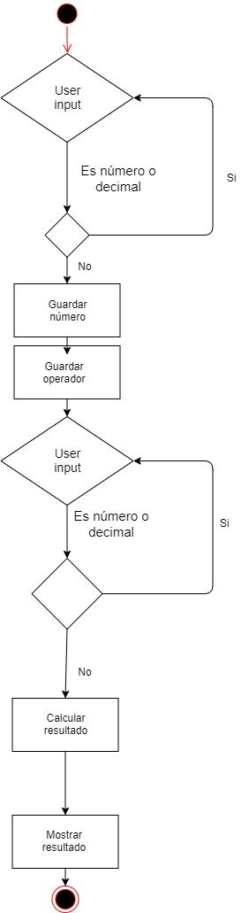

# Skylab Calculator
Ejercio de HTML + CSS + JS que muestra por pantalla una calculadora. 

## Functional Description
Permite realizar las operaciones matemáticas más habituales, tales como:
- Sumar
- Restar
- Multiplicar
- Dividir

Acepta el uso tanto de números enteros como de decimales

### Use cases

### Activity
bla bla bla

## Technical Description
bla bla bla