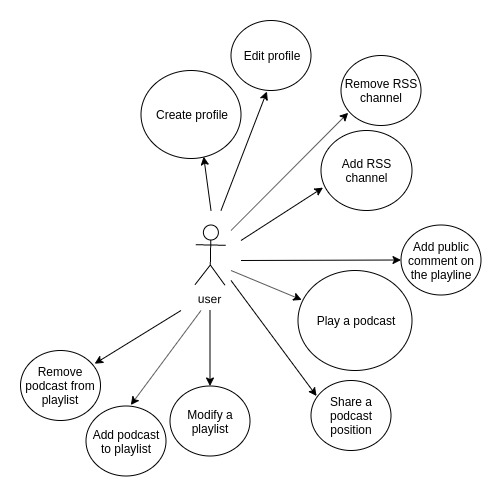
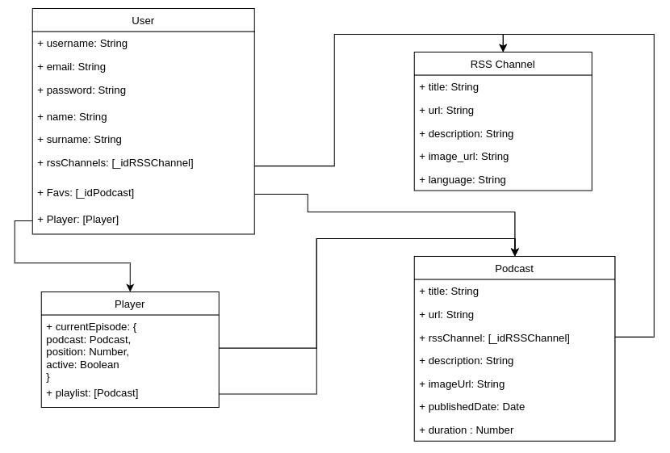

# QuickShare Podcast

If we search in Google, a podcast is a radio or television broadcast that a user can download or play on the Internet and listen to it, both on a computer and on a portable player.
Along with programming, podcast listening has become one of my most common hobbies (and in the near future, I want to create one).
In recent years, the amount of podcasts that are published has grown so much that it is increasingly difficult to have control and access to them, which is why the idea arises QuickShare Podcast as a system for reproduction and control of such publications having as key points, the possibility of continuing the reproduction of the same even changing device and expand the social component of the podcasts by adding new features such as commenting or sharing.

*Si buscamos en Google, un podcast es una emisión de radio o televisión que un usuario puede descargar o reproducir en Internet y escucharla, tanto en un ordenador como en un reproductor portátil.
Junto con la programación, escuchar podcasts se ha convertido en uno de mis pasatiempos más comunes (y en un futuro próximo, quiero crear uno).
En los últimos años, la cantidad de podcasts que se publican ha crecido tanto que cada vez es más difícil tener control y acceso a ellos, por lo que surge la idea de QuickShare Podcast como un sistema de reproducción y control de dichas publicaciones teniendo como puntos clave, la posibilidad de continuar la reproducción del mismo incluso cambiando de dispositivo y ampliar el componente social de los podcasts mediante la adición de nuevas características como comentar o compartir.*

## Functional Description

### Use Cases

The first step for the user is the registration and creation of his profile, later the generated profile can also be edited.
On the other hand, before playing the podcasts, the user can add the RSS channel to his profile (it is also possible to delete the channel so that the podcasts added to the playlist will be automatically removed from it.)
During the podcast playback, it is possible to add a comment in the podcast playback line or share the podcast with the position so that another user can play it in the same position.
As for the playlists it is possible to edit them (to order the reproduction of the files), to add new podcast or to remove them of this one.

*El primero paso para el usuario es el registro y creación de su perfil, posteriormente también se podrá editar el perfil generado.
Por otro lado, previo a la reproducción de los podcast, el usuario puede añadir el canal RSS a su perfil (también es posible eliminar el canal por lo que los podcasts añadidos a la playlist se eliminarán automáticamente de esta.)
Durante la reproducción del podcast, es posible añadir un comentario en la línea de reproducción del podcast o compartir el podcast con la posición para que otro usuario pueda reproducirlo en esa misma posición.
En cuanto a las listas de reproducción es posible editarlas (ordenar la reproducción de los archivos), añadir nuevos podcast o quitarlos de esta.*

## Technical Description

### Data Model

The project is based on a simple data model that links the user to the RSS feed and the podcast files that belong to that channel.
In the user, in addition to his user data, we will also store the RSS channels he has added and the podcast of these, which he has marked as favorites.

*El proyecto se basa en un modelo de datos sencillo que une al usuario con el canal RSS y los archivos de podcast que pertenecen a ese canal.
En el usuario, además de sus datos de usuario, almacenaremos también los canales RSS que él ha añadido y los podcast de estos, que ha marcado como favoritos.*

